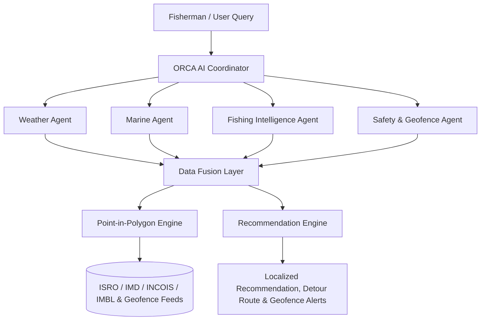

# 🌊 ORCA — AI-Powered Marine & Fishing Intelligence Prototype

> **Smart India Hackathon (SIH) Marine Fishing Solution Prototype**  
> An AI-powered marine assistant enabling fishermen to navigate safely, locate high-yield potential fishing zones, monitor maritime boundaries & vessel geofencing polygons, receive 48-hour weather forecasts, and operate offline using local intelligence packages.

---

## 🚀 Key Features & Pipeline Concept

### **Fishing Zones → Safe Routes → Geofencing & Alerts**

### 1. 📡 Vessel Geofencing & Real-Time Zone Detection
- **4 Polygon GIS Zones**:
  - 🟢 **SAFE**: Permitted domestic fishing sector (Zone A waters).
  - 🟡 **CAUTION**: Boundary buffer sector approaching restricted naval territory.
  - 🔴 **PROHIBITED**: Pulicat Naval Prohibited Defense Zone (civilian entry forbidden).
  - 🟠 **HAZARD**: Active Cyclone VARUNA high swell hazard region.
- **Point-in-Polygon Engine**: Ray-casting algorithm evaluating vessel GPS coordinates in real-time.
- **Interactive Vessel Simulation**: Playback controls (**▶ Start Simulation**, **⏸ Pause**, **↻ Reset**, speed multipliers **1×**, **2×**, **5×**, or click anywhere on the map to manually relocate the vessel).
- **Proximity Alerts & Warning Buffers**:
  - `⚠ PROHIBITED ZONE ENTRY` — *"Vessel has entered a restricted maritime area! Turn back immediately..."* (Tamil: *"⚠ தடைசெய்யப்பட்ட பகுதியில் நுழைந்துள்ளீர்கள்"*).
  - `⚠ HAZARD ZONE ENTRY` — *"Vessel has entered an active marine hazard area..."*
  - `⚠ APPROACHING RESTRICTED AREA (1.8 km)`
- **Timestamped Alert History Log**: Recorded log panel with "Clear Log History" option.

### 2. 🗺️ Automatic Route Avoidance
- Detects if direct routes cross prohibited or active hazard polygons.
- Triggers: **`⚠ Unsafe direct route detected crossing prohibited zone! Alternative safe route generated.`**
- Displays glowing cyan safe detour route avoiding all prohibited and hazard polygons.

### 3. 🛡️ Maritime Boundary Awareness (IMBL)
- **Maritime Boundary Map Layer**: Demarcates International Maritime Boundary Line (IMBL), 12nm Territorial Waters limit, and Prohibited Naval Defense Zones on the interactive Leaflet map.
- **Vessel Border Proximity Alert**: Triggers `⚠ BORDER PROXIMITY ALERT` warnings when vessels approach boundary zones.
- **Border Safety Metric**: Categorizes sectors into 🟢 **SAFE**, 🟡 **CAUTION**, and 🔴 **RESTRICTED / EXCLUDED**.

### 4. 🌐 Regional Language Support (தமிழ், English, हिन्दी, తెలుగు)
- Complete UI translation dictionary for English, Tamil, Hindi, and Telugu.
- Built-in Tamil voice/text preset demo queries:
  - *"நான் தடைசெய்யப்பட்ட மண்டலத்தில் உள்ளேனா?"*
  - *"நாளை காலை மீன்பிடிக்க எந்த இடத்திற்கு செல்லலாம்?"*
- Localized AI recommendations, geofence alerts, safety explanations, and map markers.

### 5. 🤖 Context-Aware Multi-Intent AI Assistant
- Recognizes 10+ distinct user intents (`GREETING`, `WEATHER`, `SAFETY`, `CYCLONE`, `ROUTE`, `BORDER`, `GEOFENCE`, `FISHING_ZONE`, `WHY_EXPLANATION`).
- Renders specialized UI cards (Geofence status metrics, Weather forecast metrics, Safety risk gauges, Cyclone tracking, Route navigation, Border proximity metrics).
- Resolves conversation context across turns.

### 6. 📊 Live Coastal Telemetry Dashboard
- Real-time marine metrics: Air Temp, Wind Speed/Direction, Wave Height, Sea Surface Temperature (SST), Ocean Current, Weather condition summaries, Vessel Safety Status, and Border Safety ratings.

### 7. 🌦️ 48-Hour Weather Forecast & Safety Timeline
- Coastal location switcher: **Chennai**, **Kochi**, **Visakhapatnam**, and **Thoothukudi**.
- 48-Hour Safety Timeline categorizing 3-hour windows (`06:00 Safe`, `09:00 Safe`, `12:00 Moderate`, `15:00 Increasing Wind`, `18:00 High Caution`).
- Recharts visualizations for Wind Speed, Wave Swell, and Rain Probability.

### 8. 📦 48-Hour Mission Package & Offline Mode
- Mode Toggle: **🟢 ONLINE (Cloud Active)** vs **🟠 OFFLINE (Local 48h Package Active)**.
- Operates 100% locally in browser with zero internet dependency.
- "Sync & Generate Mission Package" button with progress animation.
- "Download Package (.JSON)" button exporting offline mission data bundles.

---

## 🛠️ Technology Stack

- **Frontend**: React 19, TypeScript
- **Build Tool**: Vite 8
- **Styling**: Tailwind CSS v4 (Dark Oceanic Theme & Glassmorphism)
- **Mapping**: Leaflet, React-Leaflet
- **Charts**: Recharts
- **Icons**: Lucide React

---

## 📋 System Architecture



---

## 💻 Getting Started Locally

### Prerequisites
- Node.js (v18+)
- npm (v9+)

### Installation & Running

1. **Clone repository**:
   ```bash
   git clone https://github.com/gssanjay12/ORCA.git
   cd ORCA
   ```

2. **Install dependencies**:
   ```bash
   npm install
   ```

3. **Start local development server**:
   ```bash
   npm run dev
   ```
   Open `http://localhost:5173/` in your browser.

4. **Build production bundle**:
   ```bash
   npm run build
   ```

---

## 📄 License

This prototype was created for internal Smart India Hackathon (SIH) presentation purposes.
