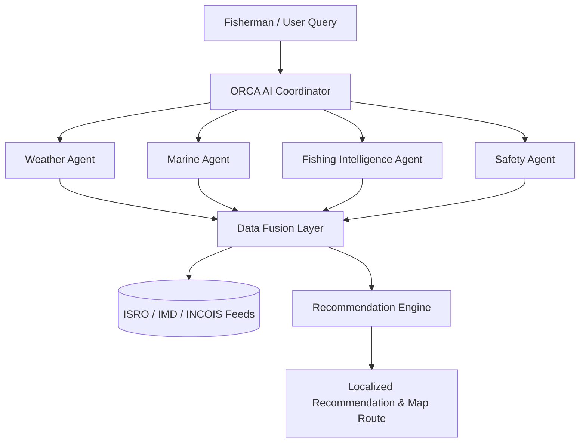

# 🌊 ORCA — AI-Powered Marine & Fishing Intelligence Prototype

> **Smart India Hackathon (SIH) Marine Fishing Solution Prototype**  
> An AI-powered marine assistant enabling fishermen to navigate safely, locate high-yield potential fishing zones, receive 48-hour weather forecasts, and operate offline using local intelligence packages.

---

## 🚀 Key Features

### 1. 🌐 Regional Language Support (தமிழ், English, हिन्दी, తెలుగు)
- Complete UI translation dictionary for English, Tamil, Hindi, and Telugu.
- Built-in Tamil voice/text preset demo query:
  > *"நாளை காலை மீன்பிடிக்க எந்த இடத்திற்கு செல்லலாம்?"*
- Localized AI recommendations, weather alerts, safety explanations, and map markers.

### 2. 📊 Live Coastal Telemetry Dashboard
- Real-time marine metrics: Air Temp, Wind Speed/Direction, Wave Height, Sea Surface Temperature (SST), Ocean Current, and Weather condition summaries.
- Instant Recommended Fishing Zone highlight card (Zone A — North East Shelf, 87% suitability, 18.4 km, 52 min travel time).
- Active Cyclone VARUNA alert indicator.

### 3. 🗺️ Interactive Dark Marine Map
- High-resolution dark marine map powered by Leaflet & CARTO Dark tiles.
- Interactive Layer Toggles:
  - **Fishing Zones** (Green 87%, Yellow 64%, Red 42%, Red 29%).
  - **Optimized Navigation Route** (Chennai Harbor ➔ Target Zone).
  - **Vessel Marker** with pulsing radar beacon.
  - **Personal Safety Radius Bubble** (10 km – 50 km configurable perimeter).
  - **Cyclone Tracking** with danger radius (65 km) and forecasted trajectory path.

### 4. 🤖 ORCA AI Assistant
- Conversational marine AI interface.
- Pre-populated suggested question chips in regional languages.
- Real-time processing animation (*"Analyzing marine conditions, ocean currents & cyclone telemetry..."*).
- Structured recommendation output cards with suitability scores, distance, travel time, and safety risk.
- **Expandable "Why this recommendation?" Section**: Breaks down SST, Chlorophyll density, Weather, Waves, and Cyclone safety margins.

### 5. 🌦️ 48-Hour Weather Forecast & Safety Timeline
- Coastal location switcher: **Chennai**, **Kochi**, **Visakhapatnam**, and **Thoothukudi**.
- 48-Hour Safety Timeline categorizing 3-hour windows (`06:00 Safe`, `09:00 Safe`, `12:00 Moderate`, `15:00 Increasing Wind`, `18:00 High Caution`).
- Recharts visualizations for Wind Speed, Wave Swell, and Rain Probability.

### 6. 🎣 Potential Fishing Zone (PFZ) Intelligence
- Chlorophyll and SST driven suitability scoring model.
- Factor breakdown bars: SST (91%), Chlorophyll (88%), Ocean Current (82%), Weather (90%), Safety (85%).
- Travel duration and fuel efficiency estimates.

### 7. 🛡️ Safety & Cyclone Hazard Warning Matrix
- Risk classification (LOW / MODERATE / HIGH / EXTREME).
- Sub-factor breakdown across Wind, Waves, Rain, Current, Cyclone Proximity, and Visibility.
- Configurable Vessel Safety Radius Slider with real-time hazard overlap detection.

### 8. 📦 48-Hour Mission Package & Offline Mode
- Mode Toggle: **🟢 ONLINE (Cloud Active)** vs **🟠 OFFLINE (Local 48h Package Active)**.
- Operates 100% locally in browser with zero internet dependency.
- "Sync & Generate Mission Package" button with progress animation.
- "Download Package (.JSON)" button exporting offline mission data bundles.

### 9. 🧠 Multi-Agent System & Data Fusion
- Animated multi-agent data flow: User Query ➔ ORCA Coordinator ➔ (Weather, Marine, Fishing, Safety Agents) ➔ Data Fusion ➔ Recommendation Engine.
- Integrates data feeds from ISRO Ocean Satellite, IMD Coastal Radar, INCOIS Wave Models, PFZ Bulletins, and Marine Vessel Sensors.

---

## 🛠️ Technology Stack

- **Frontend**: React 19, TypeScript
- **Build Tool**: Vite 8
- **Styling**: Tailwind CSS v4 (Dark Oceanic Theme & Glassmorphism)
- **Mapping**: Leaflet, React-Leaflet
- **Charts**: Recharts
- **Icons**: Lucide React

---

## 📋 System Architecture



---

## 💻 Getting Started Locally

### Prerequisites
- Node.js (v18+)
- npm (v9+)

### Installation & Running

1. **Clone repository**:
   ```bash
   git clone https://github.com/gssanjay12/ORCA.git
   cd ORCA
   ```

2. **Install dependencies**:
   ```bash
   npm install
   ```

3. **Start local development server**:
   ```bash
   npm run dev
   ```
   Open `http://localhost:5173/` in your browser.

4. **Build production bundle**:
   ```bash
   npm run build
   ```

---

## 📄 License

This prototype was created for internal Smart India Hackathon (SIH) presentation purposes.
