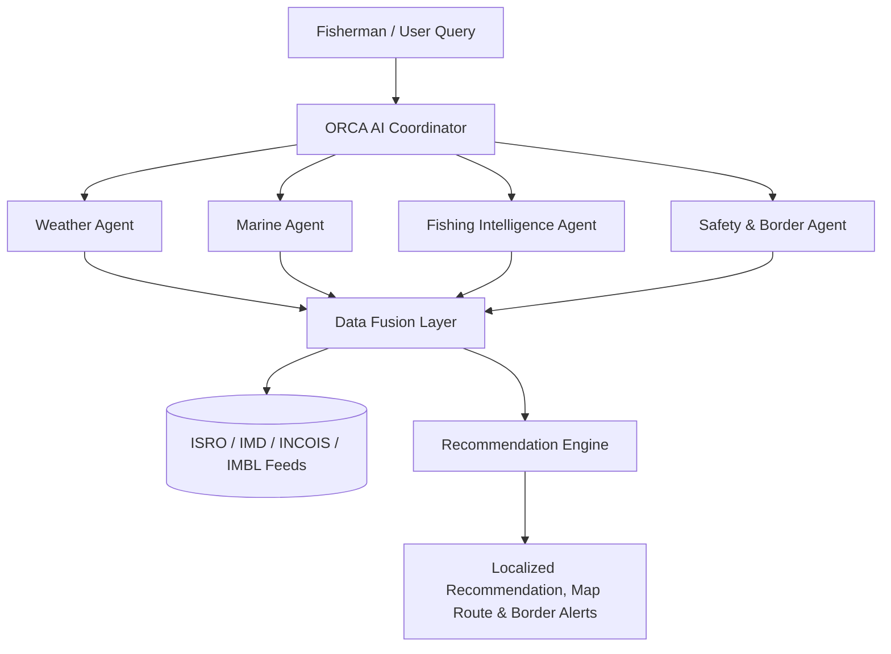

# 🌊 ORCA — AI-Powered Marine & Fishing Intelligence Prototype

> **Smart India Hackathon (SIH) Marine Fishing Solution Prototype**  
> An AI-powered marine assistant enabling fishermen to navigate safely, locate high-yield potential fishing zones, monitor maritime boundaries & border proximity, receive 48-hour weather forecasts, and operate offline using local intelligence packages.

---

## 🚀 Key Features

### 1. 🛡️ Border Protection & Maritime Boundary Awareness
- **Maritime Boundary Map Layer**: Demarcates International Maritime Boundary Line (IMBL), 12nm Territorial Waters limit, and Prohibited Naval Defense Zones on the interactive Leaflet map.
- **Vessel Border Proximity Alert**: Triggers `⚠ BORDER PROXIMITY ALERT` warnings when vessels approach boundary zones.
  - Tamil: *"எல்லைப் பகுதியை நெருங்குகிறீர்கள். பாதுகாப்பான தூரத்தைப் பராமரிக்கவும்."*
  - English: *"Your current vessel location is approaching a maritime boundary. Maintain a safe distance and verify permitted fishing sectors."*
- **Restricted Zone Exclusion**: Excludes zones inside or too close to restricted sectors (`⚠ ZONE NOT RECOMMENDED / RESTRICTED`).
- **Border Safety Metric**: Categorizes sectors into 🟢 **SAFE**, 🟡 **CAUTION**, and 🔴 **RESTRICTED / EXCLUDED**.
- **Decision Support Disclaimer**: Clearly labeled simulated datasets for demonstration purposes.

### 2. 🌐 Regional Language Support (தமிழ், English, हिन्दी, తెలుగు)
- Complete UI translation dictionary for English, Tamil, Hindi, and Telugu.
- Built-in Tamil voice/text preset demo queries:
  - *"நாளை காலை மீன்பிடிக்க எந்த இடத்திற்கு செல்லலாம்?"*
  - *"நான் எல்லைக்கு அருகில் உள்ளேனா?"*
- Localized AI recommendations, weather alerts, safety explanations, and map markers.

### 3. 🤖 Context-Aware Multi-Intent AI Assistant
- Recognizes 10+ distinct user intents (`GREETING`, `WEATHER`, `SAFETY`, `CYCLONE`, `ROUTE`, `BORDER`, `FISHING_ZONE`, `WHY_EXPLANATION`).
- Renders specialized UI cards (Weather forecast metrics, Safety risk gauges, Cyclone tracking, Route navigation, Border proximity metrics).
- Resolves conversation context across turns (e.g. *"Where should I fish?"* ➔ *"Is it safe?"* ➔ *"Show me the route"*).

### 4. 📊 Live Coastal Telemetry Dashboard
- Real-time marine metrics: Air Temp, Wind Speed/Direction, Wave Height, Sea Surface Temperature (SST), Ocean Current, Weather condition summaries, and Border Safety status.
- Instant Recommended Fishing Zone highlight card (Zone A — North East Shelf, 87% suitability, 18.4 km distance, 52 min travel time).

### 5. 🗺️ Interactive Dark Marine Map
- Powered by Leaflet & CARTO Dark tiles.
- Interactive Layer Toggles:
  - **Fishing Zones** (Green 87%, Yellow 64%, Red 42%, Red 29%).
  - **Maritime Boundaries** (IMBL Red-Dashed Line, Territorial Buffer, Prohibited Defense Sector).
  - **Optimized Navigation Route** (Chennai Harbor ➔ Target Zone).
  - **Vessel Marker** with pulsing radar beacon.
  - **Personal Safety Radius Bubble** (10 km – 50 km configurable perimeter).
  - **Cyclone Tracking** with danger radius (65 km) and forecasted trajectory path.

### 6. 🌦️ 48-Hour Weather Forecast & Safety Timeline
- Coastal location switcher: **Chennai**, **Kochi**, **Visakhapatnam**, and **Thoothukudi**.
- 48-Hour Safety Timeline categorizing 3-hour windows (`06:00 Safe`, `09:00 Safe`, `12:00 Moderate`, `15:00 Increasing Wind`, `18:00 High Caution`).
- Recharts visualizations for Wind Speed, Wave Swell, and Rain Probability.

### 7. 📦 48-Hour Mission Package & Offline Mode
- Mode Toggle: **🟢 ONLINE (Cloud Active)** vs **🟠 OFFLINE (Local 48h Package Active)**.
- Operates 100% locally in browser with zero internet dependency.
- "Sync & Generate Mission Package" button with progress animation.
- "Download Package (.JSON)" button exporting offline mission data bundles.

---

## 🛠️ Technology Stack

- **Frontend**: React 19, TypeScript
- **Build Tool**: Vite 8
- **Styling**: Tailwind CSS v4 (Dark Oceanic Theme & Glassmorphism)
- **Mapping**: Leaflet, React-Leaflet
- **Charts**: Recharts
- **Icons**: Lucide React

---

## 📋 System Architecture



---

## 💻 Getting Started Locally

### Prerequisites
- Node.js (v18+)
- npm (v9+)

### Installation & Running

1. **Clone repository**:
   ```bash
   git clone https://github.com/gssanjay12/ORCA.git
   cd ORCA
   ```

2. **Install dependencies**:
   ```bash
   npm install
   ```

3. **Start local development server**:
   ```bash
   npm run dev
   ```
   Open `http://localhost:5173/` in your browser.

4. **Build production bundle**:
   ```bash
   npm run build
   ```

---

## 📄 License

This prototype was created for internal Smart India Hackathon (SIH) presentation purposes.
